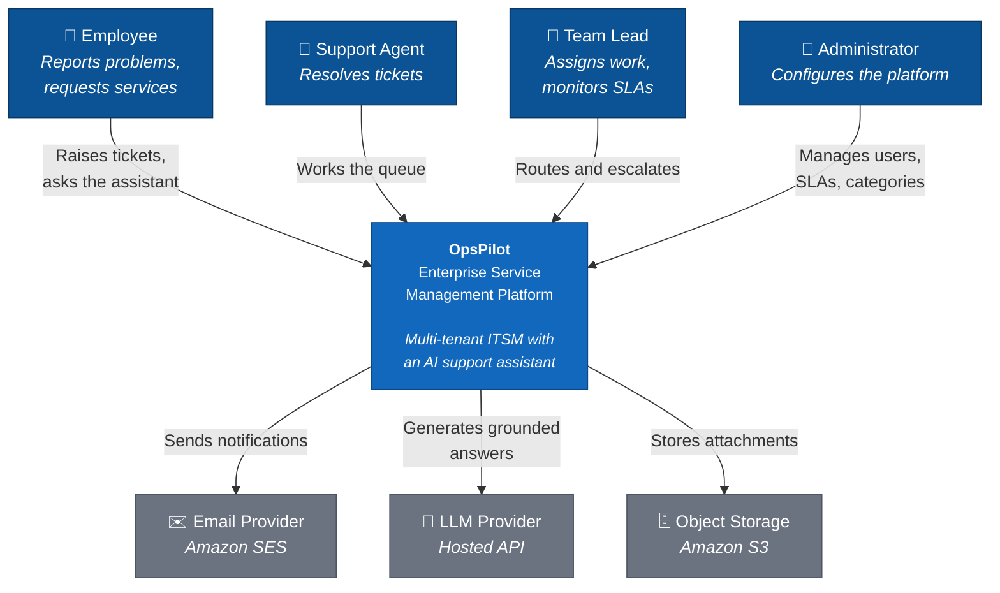
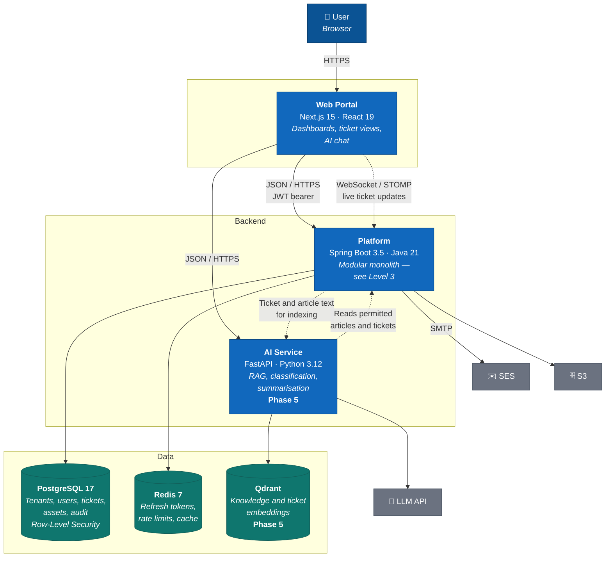
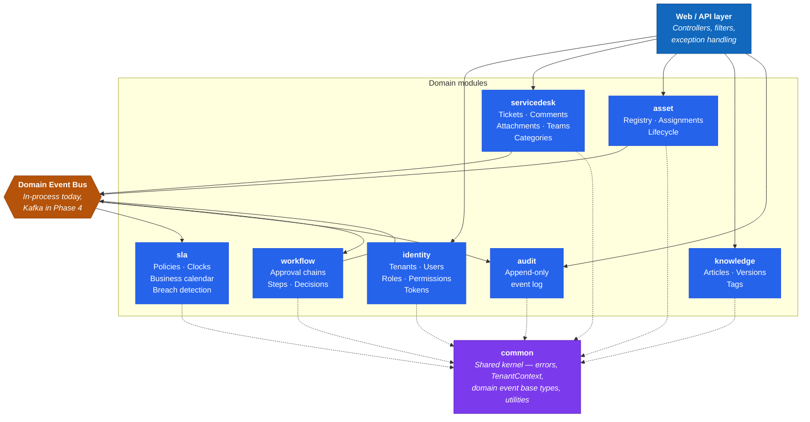
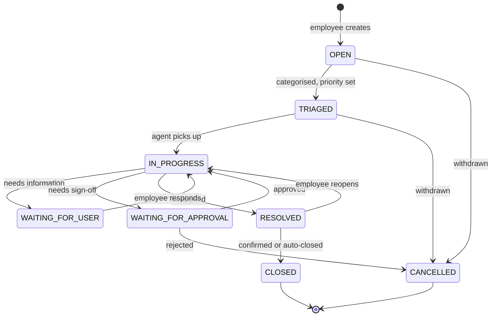
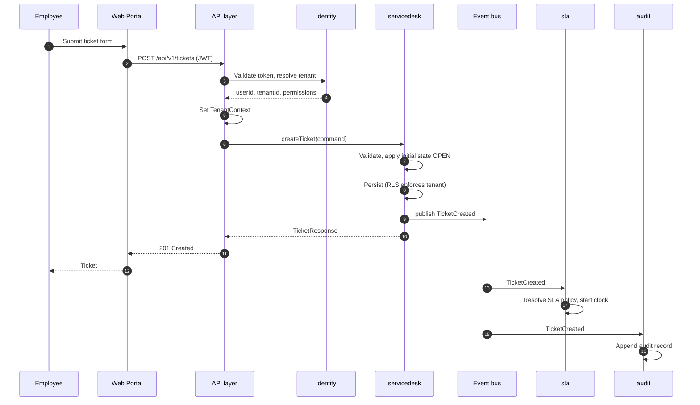
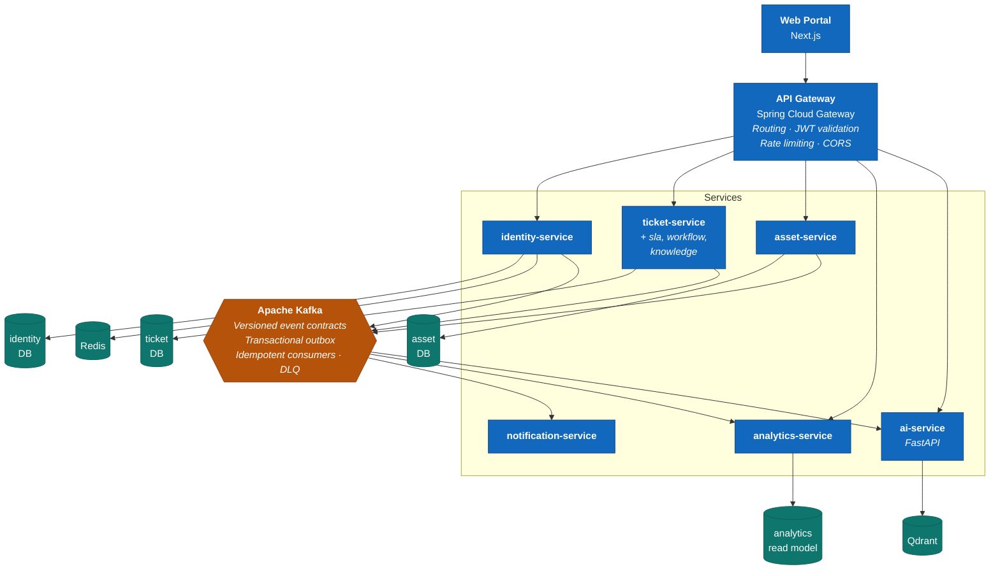

# OpsPilot Architecture

Documented using the [C4 model](https://c4model.com/): four levels of zoom, each aimed at
a different audience. Diagrams are Mermaid source so they live in Git, diff like code, and
render directly on GitHub.

| Level | Question it answers | Audience |
|---|---|---|
| 1 — Context | What is the system and who uses it? | Everyone |
| 2 — Container | What are the deployable pieces? | Technical |
| 3 — Component | What is inside a container? | Developers |
| 4 — Code | How is a component implemented? | Covered by the code itself |

> **Current state: Phase 0.** These diagrams describe the target for Phases 0–3. The
> Phase 4 target state is shown separately at the end.

---

## Level 1 — System Context

Who uses OpsPilot and what it depends on.

### The four roles

| Role | Can do |
|---|---|
| **Employee** | Create and view own tickets, comment, attach files, search the knowledge base, use the AI assistant, approve requests assigned to them |
| **Support Agent** | Everything above, plus: view and pick up queue tickets, change status, add internal notes, resolve |
| **Team Lead** | Everything above, plus: view all team tickets, assign and reassign, monitor SLAs, escalate, view team analytics |
| **Administrator** | Manage users, teams, roles, categories, SLA policies, assets, knowledge base; view audit logs |

Permissions are fine-grained (`TICKET_ASSIGN`, `AUDIT_VIEW`); roles are named bundles of
permissions. See [ADR-0003](../adr/0003-in-house-identity-service.md).

---

## Level 2 — Containers (Phases 0–3)

The deployable pieces and the data stores behind them.

Dotted lines are asynchronous or deferred to a later phase.

---

## Level 3 — Components inside the Platform

The modules of the monolith. Each is a separate Maven module with an enforced boundary,
and each becomes a candidate microservice in Phase 4. See
[ADR-0001](../adr/0001-modular-monolith.md).

### The five boundary rules

Enforced by ArchUnit tests. A violation fails the build.

1. A module exposes only its `api` package — everything else is internal
2. No cross-module JPA relationships — reference by ID, never `@ManyToOne`
3. No cross-module foreign keys in the database
4. Modules talk through published interfaces or domain events, never another module's repository
5. The domain layer depends on nothing — no Spring, no JPA, no HTTP

Rules 2 and 3 are the critical pair. A foreign key across a module boundary is exactly
what makes a database impossible to split later.

---

## Ticket lifecycle

The core state machine. Transitions are defined in an explicit table in the domain layer,
so an illegal transition such as `CLOSED → IN_PROGRESS` is rejected by the domain model
rather than by a controller check.

**The SLA clock pauses in `WAITING_FOR_USER`.** Time spent waiting on the reporter must
not count against the resolution target, or every blocked ticket produces a false breach.

---

## Domain events

Published by the module that owns the change; consumed by any module that needs to react.
Spring application events in Phases 0–3, the same classes over Kafka from Phase 4.

| Event | Published by | Consumed by |
|---|---|---|
| `TicketCreated` | servicedesk | sla, audit, notification, ai |
| `TicketAssigned` | servicedesk | notification, audit, analytics |
| `TicketStatusChanged` | servicedesk | sla, audit, notification |
| `TicketPriorityChanged` | servicedesk | sla, audit |
| `TicketCommentAdded` | servicedesk | notification, audit |
| `TicketResolved` | servicedesk | sla, audit, notification, knowledge |
| `TicketClosed` | servicedesk | analytics, audit |
| `SlaWarningRaised` | sla | notification, analytics |
| `SlaBreached` | sla | notification, analytics, audit |
| `ApprovalRequested` | workflow | notification, audit |
| `ApprovalDecided` | workflow | servicedesk, notification, audit |
| `AssetAssigned` | asset | audit, notification |
| `KnowledgeArticlePublished` | knowledge | ai (re-index) |

Every event carries `eventId`, `tenantId`, `occurredAt` and `actorId`. `eventId` is what
makes Phase 4 consumers idempotent.

---

## Request flow — creating a ticket

Note step 5: the tenant comes from the **validated token**, never from the request body.
See [ADR-0002](../adr/0002-multi-tenancy-strategy.md).

---

## Phase 4 target — distributed architecture

What the modules become once extracted. Nothing in the domain code changes; the transport
between modules does.

`sla`, `workflow` and `knowledge` stay inside `ticket-service`. They are tightly coupled to
the ticket aggregate and share its transaction boundary — splitting them would buy
distributed transactions for no benefit. **Six services, not fifteen.**

---

## Related documents

| Document | Contents |
|---|---|
| [PLAN.md](../../PLAN.md) | Delivery plan, phases, exit criteria |
| [docs/adr/](../adr/) | Why each decision was made |
| [CONTRIBUTING.md](../../CONTRIBUTING.md) | The boundary rules as enforced practice |
